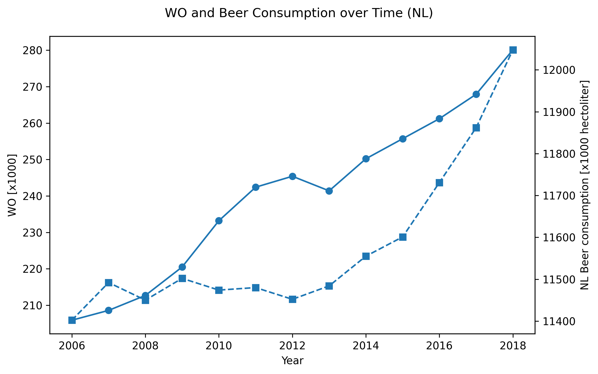

Edoardo Giacomo Putignano
Student ID = 16048229

Paper titles:

1. _The Rise of Coccidioides: Forces Against the Dust Devil Unleashed_ Van Dyke, M.C.C., Thompson, G.R., Galgiani, J.N., & Barker, B.M. (2019). Frontiers in Immunology, 10, 2188.
2. _An analysis of the forces required to drag sheep over various surfaces_ Harvey, J.T., Culvenor, J., Payne, W., Cowley, S., Lawrance, M., Stuart, D., & Williams, R. (2002). Applied Ergonomics, 33, 523–531.
3. _The neurocognitive effects of alcohol on adolescents and college students_ Zeigler, D.W., Wang, C.C., Yoast, R.A., Dickinson, B.D., McCaffree, M.A., Robinowitz, C.B., & Sterling, M.L. (2005). Preventive Medicine, 40(1), 23–32.

The time series plot shows that both the number of WO graduates and beer consumption in the Netherlands steadily increased between 2006 and 2018. The two curves move in the same general direction, suggesting a positive association. However, this parallel growth is most likely coincidental: the upward trends may reflect independent developments over time rather than a direct causal link between the two variables.
