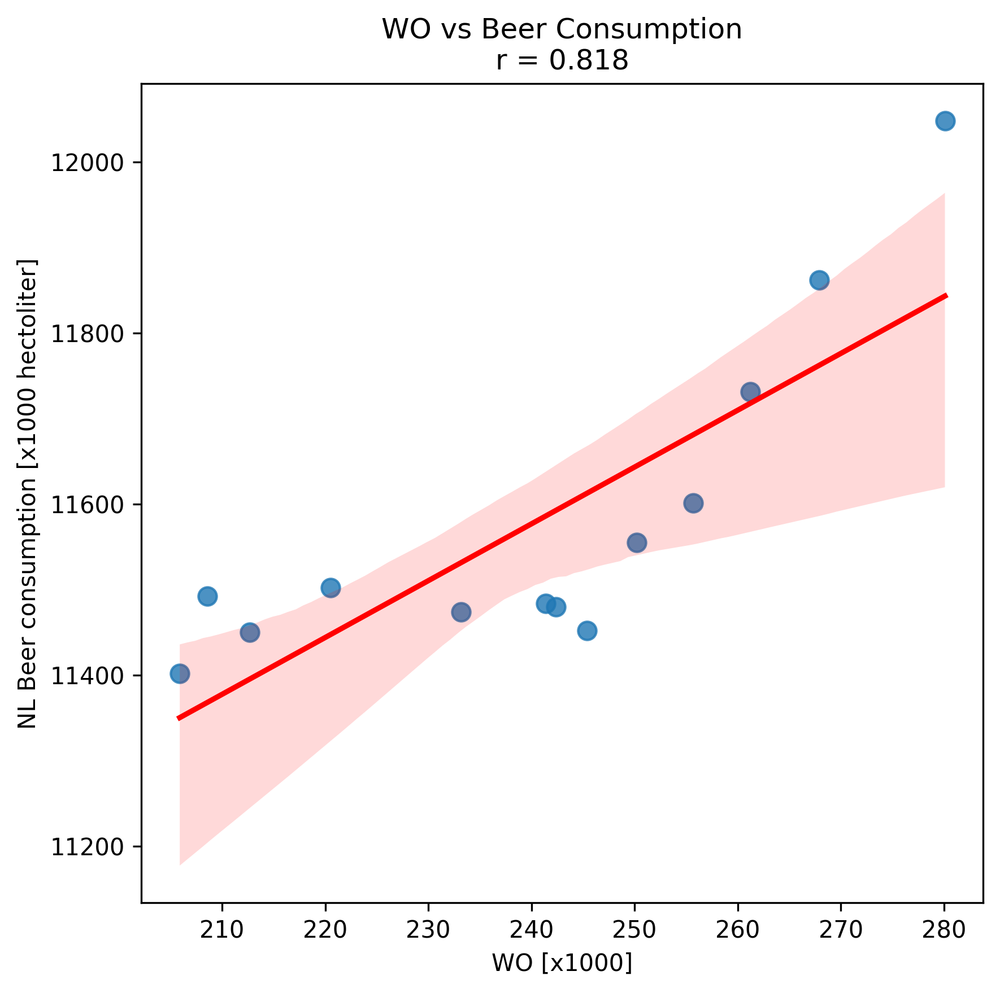

Edoardo Giacomo Putignano
Student ID = 16048229

Paper titles:

1. _The Rise of Coccidioides: Forces Against the Dust Devil Unleashed_ Van Dyke, M.C.C., Thompson, G.R., Galgiani, J.N., & Barker, B.M. (2019). Frontiers in Immunology, 10, 2188.
2. _An analysis of the forces required to drag sheep over various surfaces_ Harvey, J.T., Culvenor, J., Payne, W., Cowley, S., Lawrance, M., Stuart, D., & Williams, R. (2002). Applied Ergonomics, 33, 523–531.
3. _The neurocognitive effects of alcohol on adolescents and college students_ Zeigler, D.W., Wang, C.C., Yoast, R.A., Dickinson, B.D., McCaffree, M.A., Robinowitz, C.B., & Sterling, M.L. (2005). Preventive Medicine, 40(1), 23–32.

The scatter plot shows a strong positive correlation between the number of WO graduates and beer consumption in the Netherlands from 2006–2018. Both variables increase over time, and the linear fit indicates they move together. However, this apparent relationship may be spurious: it reflects coinciding upward trends rather than one causing the other.

